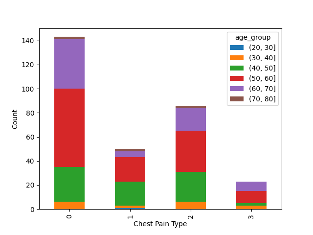
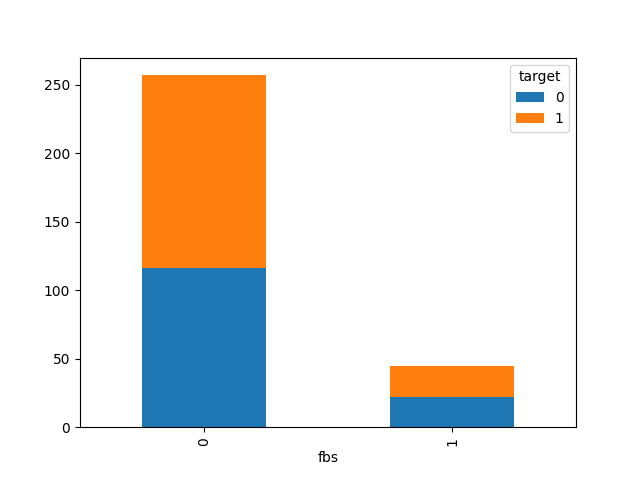
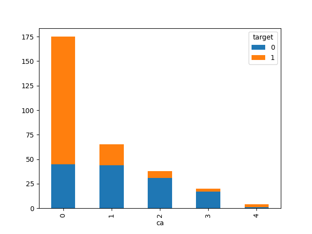
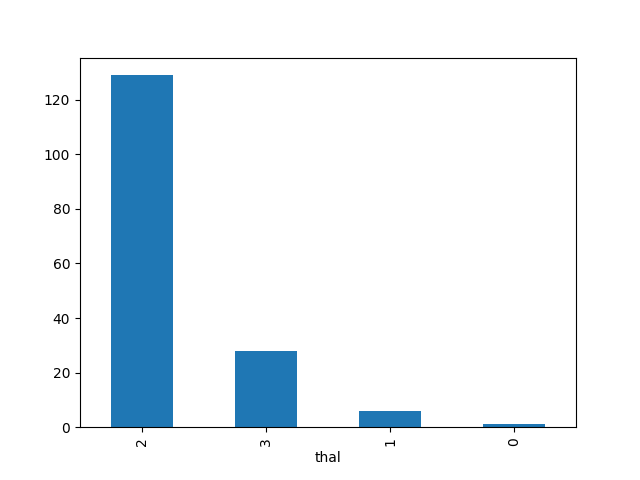
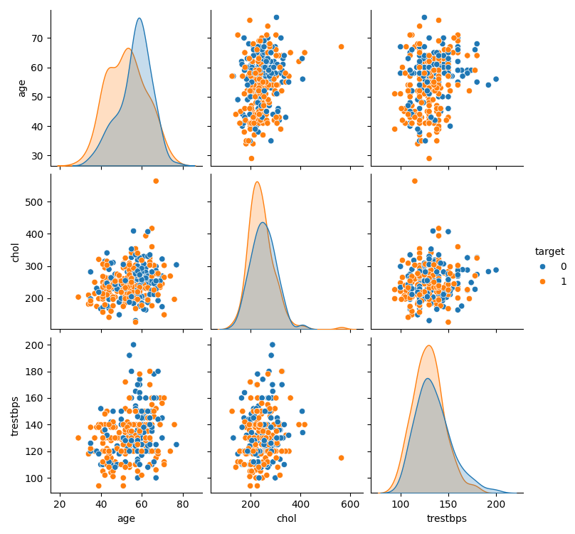
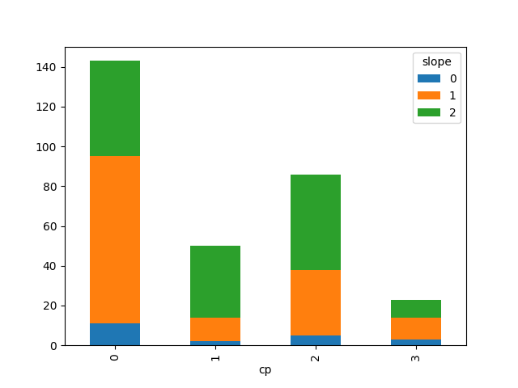
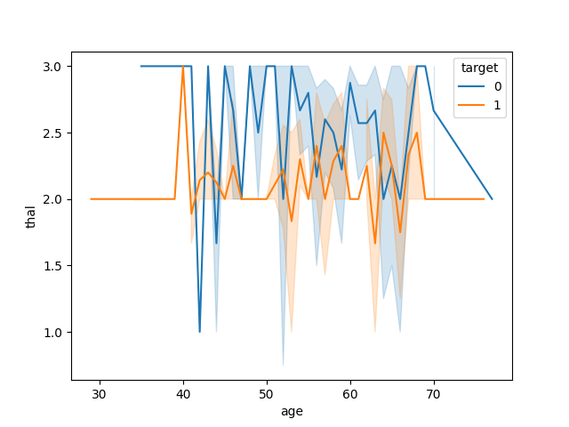

# Pulse of Prevention: Heart Disease Data Analysis

This project performs **Exploratory Data Analysis (EDA)** on a Heart Disease dataset to identify patterns and risk factors associated with cardiovascular conditions.  
The analysis examines how **patient demographics, clinical measurements, and medical history** relate to heart disease outcomes to help identify **high-risk patient profiles**.

---
## Dataset Summary

<table>
<tr>

<td>

### Dataset Metrics

| Metric | Value |
|------|------|
| Total Records | 1025 |
| Total Features | 14 |
| Numeric Features | 14 |
| Target Variable | Heart Disease Presence |

</td>

<td>

### Key Statistics

| Metric | Value |
|------|------|
| Average Age | 54.43 |
| Avg Cholesterol | 246 mg/dl |
| Resting BP | 131.61 mmHg |
| Max Heart Rate | 149.11 bpm |

</td>

<td>

### Gender Distribution

| Gender | Count |
|------|------|
| Male | 206 |
| Female | 96 |

</td>

</tr>
</table>

---

## Clinical Indicators

<table>
<tr>

<td>

### Major Vessel Distribution

| Vessels | Count |
|------|------|
| 0 | 175 |
| 1 | 65 |
| 2 | 38 |
| 3 | 20 |
| 4 | 4 |

</td>

<td>

### Key Risk Indicators

| Indicator | Average |
|------|------|
| Cholesterol | 246 mg/dl |
| Resting BP | 131.61 mmHg |
| Max Heart Rate | 149 bpm |

</td>

</tr>
</table>


## Exploratory Analysis

The analysis focuses on identifying relationships between clinical variables and heart disease risk.

Key analysis areas include:

- Chest pain distribution across age groups  
- Fasting blood sugar vs heart disease presence  
- Impact of major vessels on disease detection  
- Thalassemia distribution among patients  
- Combined risk factors (Age, Cholesterol, Blood Pressure)  
- ST segment slope variation across chest pain types  
- Survival trends across thalassemia types  

---

## Project Structure

```
Heart-Disease-Analysis
│
├── Heart_Disease.ipynb
├── screenshot1.png
├── screenshot2.png
├── screenshot3.png
├── screenshot4.png
└── README.md
```

---


---

## Visualizations

<table>
<tr>
<td align="center"><b>Chest Pain by Age</b></td>
<td align="center"><b>Fasting Blood Sugar vs Heart Disease</b></td>
</tr>
<tr>
<td></td>
<td></td>
</tr>

<tr>
<td align="center"><b>Major Vessels vs Disease</b></td>
<td align="center"><b>Thalassemia Distribution</b></td>
</tr>
<tr>
<td></td>
<td></td>
</tr>

<tr>
<td align="center"><b>Combined Risk Factors</b></td>
<td align="center"><b>ST Segment Slope vs Chest Pain</b></td>
</tr>
<tr>
<td></td>
<td></td>
</tr>
</table>

<p align="center">
<b>Thalassemia Survival Analysis</b><br>

</p>

---

## Key Insights

- Average patient age is **~54 years**
- The dataset contains **more male patients**
- Average cholesterol level is **246 mg/dl**
- Average resting blood pressure is **131 mmHg**
- Average maximum heart rate is **149 bpm**
- Most patients show **0 major vessels detected**

---

## Author

Bhargav Kumar
